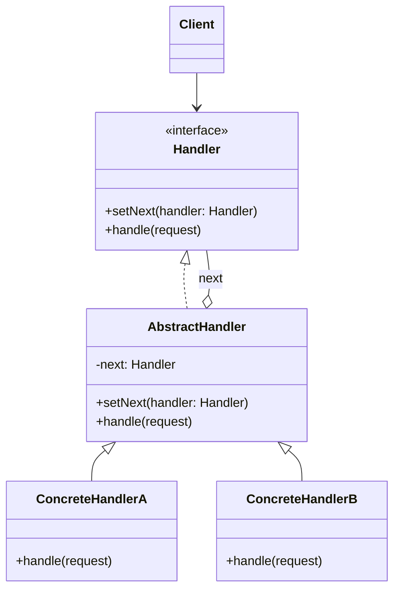
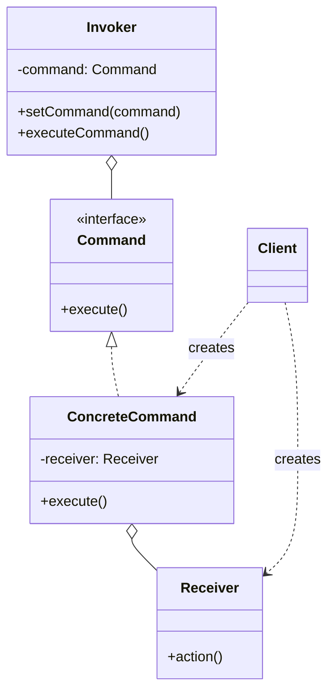
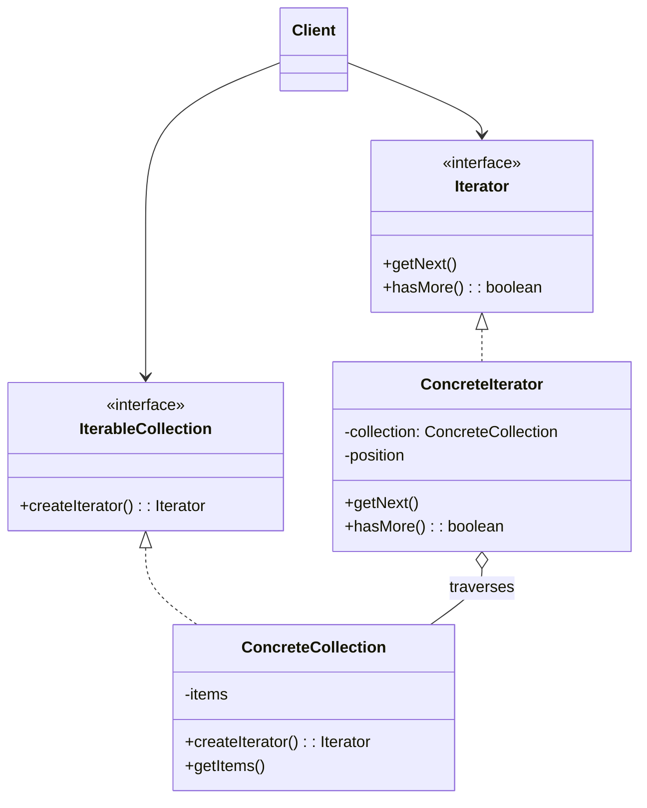
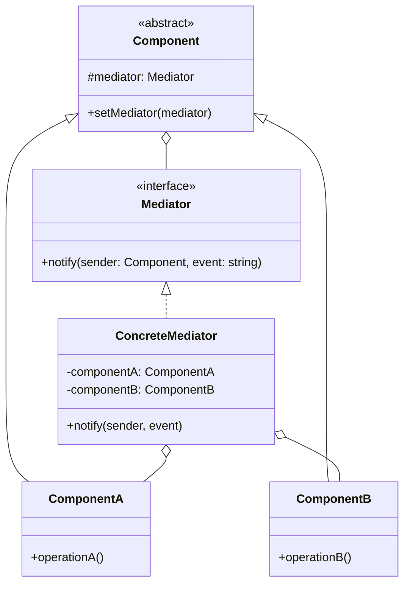
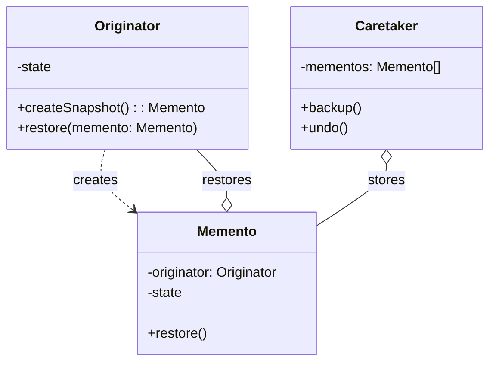
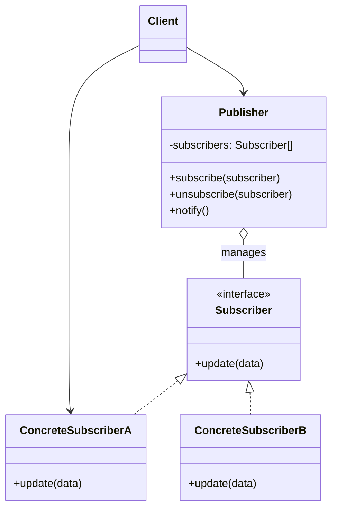
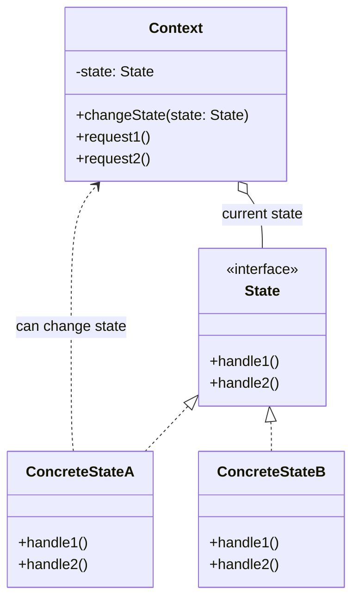
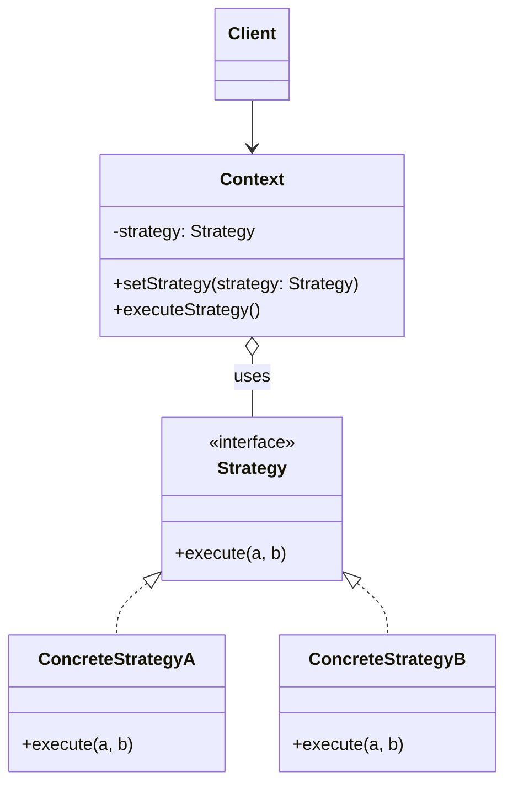
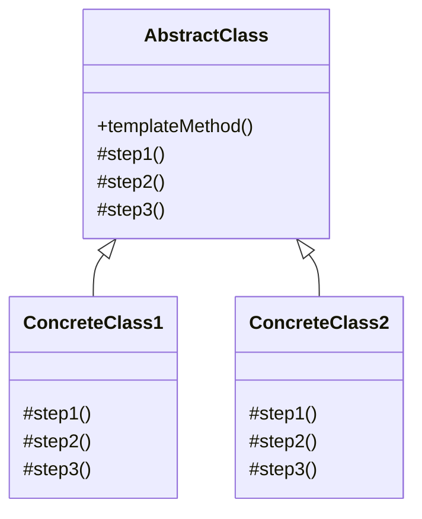
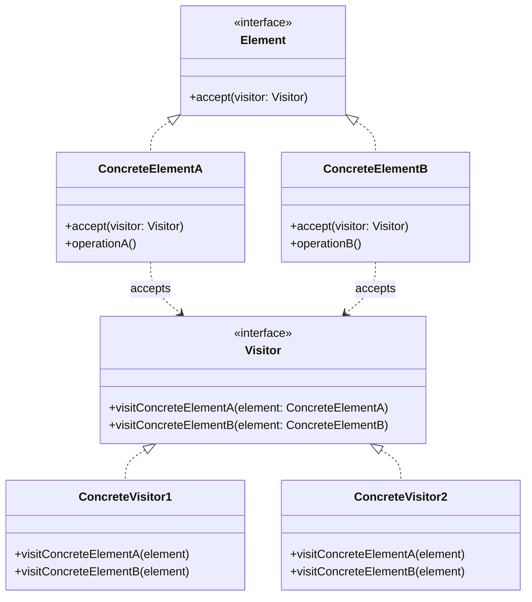

# Behavioral Design Patterns

Detailed reference for the 10 behavioral patterns that deal with object interaction and responsibility distribution.

---

## Chain of Responsibility

### Intent
Passes requests along a chain of handlers. Upon receiving a request, each handler decides either to process it or pass it to the next handler.

### Problem
You have multiple potential handlers for a request, but you don't know which should handle it or want them to process in sequence.

### Solution
Link handlers into a chain. Each handler has reference to next handler. Request travels along chain until handled.

### Real-World Analogy
Tech support call—automated system → operator → engineer. Request passes through until someone handles it.

### Structure (Mermaid)



### Pseudocode

```pseudocode
// Handler interface
interface Handler is
    method setNext(handler: Handler): Handler
    method handle(request): string

// Base handler
abstract class AbstractHandler implements Handler is
    private field nextHandler: Handler

    method setNext(handler: Handler): Handler is
        this.nextHandler = handler
        return handler  // Enable chaining

    method handle(request): string is
        if (nextHandler != null)
            return nextHandler.handle(request)
        return null

// Concrete handlers
class MonkeyHandler extends AbstractHandler is
    method handle(request): string is
        if (request == "Banana")
            return "Monkey: I'll eat the Banana"
        return super.handle(request)

class SquirrelHandler extends AbstractHandler is
    method handle(request): string is
        if (request == "Nut")
            return "Squirrel: I'll eat the Nut"
        return super.handle(request)

class DogHandler extends AbstractHandler is
    method handle(request): string is
        if (request == "MeatBall")
            return "Dog: I'll eat the MeatBall"
        return super.handle(request)
```

### Applicability
- When program must process requests in various ways, exact types unknown
- When essential to execute handlers in particular order
- When set of handlers and order should change at runtime

### How to Implement
1. Declare handler interface with handling method
2. Create abstract handler with field for next handler
3. Create concrete handlers implementing handling logic
4. Client assembles chains or receives pre-built chains
5. Client triggers any handler in chain

### Pros and Cons

**Pros:**
- Control order of request handling
- Single Responsibility Principle
- Open/Closed Principle

**Cons:**
- Some requests may end up unhandled

### Relations with Other Patterns
- CoR, Command, Mediator, Observer address different ways of connecting senders and receivers
- CoR often used with Composite (leaf passes to parent chain)
- Handlers can be implemented as Commands
- CoR and Decorator have similar class structures but different intents

---

## Command

### Intent
Turns a request into a stand-alone object containing all information about the request.

### Problem
You need to parameterize objects with operations, queue operations, schedule execution, or support undo.

### Solution
Extract request details (object, method, arguments) into separate command class with single execution method.

### Real-World Analogy
Restaurant order—waiter takes order (command), kitchen executes it. Order can be queued, tracked, or modified.

### Structure (Mermaid)



### Pseudocode

```pseudocode
// Command interface
interface Command is
    method execute(): boolean
    method undo()

// Base command with common functionality
abstract class Command is
    protected field app: Application
    protected field editor: Editor
    protected field backup: string

    method saveBackup() is
        backup = editor.text

    method undo() is
        editor.text = backup

// Concrete commands
class CopyCommand extends Command is
    method execute(): boolean is
        app.clipboard = editor.getSelection()
        return false  // No history needed

class CutCommand extends Command is
    method execute(): boolean is
        saveBackup()
        app.clipboard = editor.getSelection()
        editor.deleteSelection()
        return true  // Save to history

class PasteCommand extends Command is
    method execute(): boolean is
        saveBackup()
        editor.replaceSelection(app.clipboard)
        return true

// Invoker
class CommandHistory is
    private field history: Stack of Command

    method push(command) is
        history.push(command)

    method pop(): Command is
        return history.pop()

// Receiver
class Editor is
    field text: string
    method getSelection(): string
    method deleteSelection()
    method replaceSelection(text)
```

### Applicability
- When you want to parameterize objects with operations
- When you want to queue, schedule, or execute operations remotely
- When you want to implement reversible operations

### How to Implement
1. Declare command interface with single execution method
2. Extract requests into concrete command classes
3. Identify classes acting as invokers, add command fields
4. Change invokers to execute commands instead of direct calls
5. Client creates receivers, commands, and invokers

### Pros and Cons

**Pros:**
- Single Responsibility Principle
- Open/Closed Principle
- Implement undo/redo
- Deferred execution
- Compose simple commands into complex ones

**Cons:**
- Code may become more complicated

### Relations with Other Patterns
- CoR, Command, Mediator, Observer address different ways of connecting senders and receivers
- Handlers can be implemented as Commands
- Command and Memento together implement undo
- Command and Strategy seem similar but have different intents
- Prototype can help save copies of Commands into history
- Visitor is powerful version of Command

---

## Iterator

### Intent
Traverses elements of a collection without exposing its underlying representation.

### Problem
You need to traverse various collection types uniformly without knowing their internal structure.

### Solution
Extract traversal behavior into separate iterator object. Iterator tracks position and provides methods to get next element.

### Real-World Analogy
Different ways to explore Rome—random wandering, smartphone guide, or human guide. All are iterators over the same collection.

### Structure (Mermaid)



### Pseudocode

```pseudocode
// Iterator interface
interface ProfileIterator is
    method getNext(): Profile
    method hasMore(): boolean

// Concrete iterator
class FacebookIterator implements ProfileIterator is
    private field facebook: Facebook
    private field profileId: string
    private field type: string
    private field currentPosition: int
    private field cache: array of Profile

    method getNext(): Profile is
        if (hasMore())
            profile = cache[currentPosition]
            currentPosition++
            return profile

    method hasMore(): boolean is
        lazyInit()
        return currentPosition < cache.length

    private method lazyInit() is
        if (cache == null)
            cache = facebook.socialGraphRequest(profileId, type)

// Collection interface
interface SocialNetwork is
    method createFriendsIterator(profileId): ProfileIterator
    method createCoworkersIterator(profileId): ProfileIterator

// Concrete collection
class Facebook implements SocialNetwork is
    field profiles: array of Profile

    method createFriendsIterator(profileId): ProfileIterator is
        return new FacebookIterator(this, profileId, "friends")
```

### Applicability
- When collection has complex structure you want to hide
- To reduce duplication of traversal code
- When code should traverse different data structures

### How to Implement
1. Declare iterator interface with methods for fetching elements
2. Declare collection interface with method for creating iterators
3. Implement concrete iterators for collections
4. Implement collection interface in collection classes
5. Replace traversal code with iterator usage

### Pros and Cons

**Pros:**
- Single Responsibility Principle
- Open/Closed Principle
- Iterate same collection in parallel
- Delay iteration and continue later

**Cons:**
- May be overkill for simple collections
- May be less efficient than direct traversal

### Relations with Other Patterns
- Iterators can traverse Composite trees
- Factory Method used with Iterator for different iterator types
- Memento can capture iteration state for rollback
- Visitor with Iterator traverses complex structures

---

## Mediator

### Intent
Reduces chaotic dependencies between objects by restricting direct communication and forcing collaboration via mediator object.

### Problem
Objects communicate directly causing tight coupling and hard-to-change code.

### Solution
Eliminate direct references between components. Make them collaborate indirectly through mediator object.

### Real-World Analogy
Air traffic control tower—pilots don't talk directly, they communicate through tower. Tower enforces landing order.

### Structure (Mermaid)



### Pseudocode

```pseudocode
// Mediator interface
interface Mediator is
    method notify(sender: Component, event: string)

// Concrete mediator
class AuthenticationDialog implements Mediator is
    private field title: string
    private field loginOrRegisterChkBx: Checkbox
    private field loginUsername: Textbox
    private field loginPassword: Textbox
    private field registrationUsername: Textbox
    private field okBtn: Button
    private field cancelBtn: Button

    method notify(sender, event) is
        if (sender == loginOrRegisterChkBx and event == "check")
            if (loginOrRegisterChkBx.checked)
                title = "Log in"
                // Show login form, hide registration
            else
                title = "Register"
                // Show registration, hide login

        if (sender == okBtn and event == "click")
            if (loginOrRegisterChkBx.checked)
                // Validate login credentials
            else
                // Create user account

// Base component
class Component is
    field dialog: Mediator

    constructor Component(dialog) is
        this.dialog = dialog

    method click() is
        dialog.notify(this, "click")

// Concrete components
class Button extends Component is
    // ...

class Checkbox extends Component is
    method check() is
        dialog.notify(this, "check")
```

### Applicability
- When hard to change classes tightly coupled to others
- When can't reuse component due to dependencies
- When creating tons of subclasses just to reuse basic behavior

### How to Implement
1. Identify tightly coupled classes
2. Declare mediator interface with communication protocol
3. Implement concrete mediator with references to all components
4. Make mediator responsible for component creation/destruction (optional)
5. Components store reference to mediator
6. Components call mediator instead of other components

### Pros and Cons

**Pros:**
- Single Responsibility Principle
- Open/Closed Principle
- Reduce coupling between components
- Reuse individual components easier

**Cons:**
- Mediator can become God Object

### Relations with Other Patterns
- CoR, Command, Mediator, Observer address different ways of connecting senders and receivers
- Facade and Mediator organize collaboration differently—Facade simplifies interface, Mediator centralizes communication
- Mediator and Observer differences are often subtle

---

## Memento

### Intent
Saves and restores previous state of an object without revealing implementation details.

### Problem
You need to implement undo by saving object state, but exposing state violates encapsulation.

### Solution
Make object itself responsible for creating state snapshots. Store snapshots in memento objects that only originator can access.

### Real-World Analogy
Undo in text editor—each action creates state snapshot you can restore.

### Structure (Mermaid)



### Pseudocode

```pseudocode
// Originator
class Editor is
    private field text: string
    private field curX, curY: int
    private field selectionWidth: int

    method setText(text) is
        this.text = text

    method setCursor(x, y) is
        this.curX = x
        this.curY = y

    method setSelectionWidth(width) is
        this.selectionWidth = width

    method createSnapshot(): Snapshot is
        return new Snapshot(this, text, curX, curY, selectionWidth)

// Memento
class Snapshot is
    private field editor: Editor
    private field text: string
    private field curX, curY: int
    private field selectionWidth: int

    constructor Snapshot(editor, text, curX, curY, selectionWidth) is
        this.editor = editor
        this.text = text
        this.curX = curX
        this.curY = curY
        this.selectionWidth = selectionWidth

    method restore() is
        editor.setText(text)
        editor.setCursor(curX, curY)
        editor.setSelectionWidth(selectionWidth)

// Caretaker
class Command is
    private field backup: Snapshot

    method makeBackup() is
        backup = editor.createSnapshot()

    method undo() is
        if (backup != null)
            backup.restore()
```

### Applicability
- When you need snapshots of object state to restore previous state
- When direct access to fields violates encapsulation

### How to Implement
1. Determine originator class
2. Create memento class with fields mirroring originator
3. Make memento immutable
4. Add method to originator for producing mementos
5. Add method to originator for restoring from memento
6. Caretaker tracks when to request/save/restore mementos

### Pros and Cons

**Pros:**
- Produce snapshots without violating encapsulation
- Simplify originator code

**Cons:**
- May consume lots of RAM
- Caretakers must track originator lifecycle
- Dynamic languages can't guarantee memento state untouched

### Relations with Other Patterns
- Command and Memento together implement undo
- Memento with Iterator captures iteration state
- Prototype can be simpler alternative for straightforward objects

---

## Observer

### Intent
Defines subscription mechanism to notify multiple objects about events happening to observed object.

### Problem
Changes to one object require changing others, and you don't know how many objects need to change.

### Solution
Add subscription mechanism to publisher class. Subscribers can subscribe/unsubscribe and receive notifications.

### Real-World Analogy
Newspaper subscription—publisher maintains subscriber list, sends issues to all subscribers automatically.

### Structure (Mermaid)



### Pseudocode

```pseudocode
// Publisher
class EventManager is
    private field listeners: Map of event types and listeners

    method subscribe(eventType, listener) is
        listeners.add(eventType, listener)

    method unsubscribe(eventType, listener) is
        listeners.remove(eventType, listener)

    method notify(eventType, data) is
        foreach (listener in listeners.of(eventType)) do
            listener.update(data)

// Concrete publisher
class Editor is
    public field events: EventManager
    private field file: File

    constructor Editor() is
        events = new EventManager()

    method openFile(path) is
        this.file = new File(path)
        events.notify("open", file.name)

    method saveFile() is
        file.write()
        events.notify("save", file.name)

// Subscriber interface
interface EventListener is
    method update(filename)

// Concrete subscribers
class LoggingListener implements EventListener is
    private field log: File
    private field message: string

    method update(filename) is
        log.write(replace('%s', filename, message))

class EmailAlertsListener implements EventListener is
    private field email: string
    private field message: string

    method update(filename) is
        system.email(email, replace('%s', filename, message))
```

### Applicability
- When changes to one object require changing others
- When some objects must observe others for limited time

### How to Implement
1. Divide business logic into publisher and subscribers
2. Declare subscriber interface
3. Declare publisher interface with subscribe/unsubscribe methods
4. Decide where subscription list lives
5. Create concrete publishers
6. Implement update in concrete subscribers
7. Client creates and registers subscribers

### Pros and Cons

**Pros:**
- Open/Closed Principle
- Establish relations at runtime

**Cons:**
- Subscribers notified in random order

### Relations with Other Patterns
- CoR, Command, Mediator, Observer address different ways of connecting senders and receivers
- Mediator and Observer differences are often subtle
- Observer and Mediator can be used together

---

## State

### Intent
Alters object's behavior when internal state changes. Object appears to change class.

### Problem
Object behavior depends on state, and behavior changes at runtime based on many state-specific code in methods.

### Solution
Create new classes for all states. Extract state-specific behaviors into these classes. Original object delegates work to state object.

### Real-World Analogy
Smartphone buttons behave differently based on state: unlocked, locked, low battery.

### Structure (Mermaid)



### Pseudocode

```pseudocode
// State interface
abstract class State is
    protected field player: AudioPlayer

    constructor State(player) is
        this.player = player

    abstract method clickLock()
    abstract method clickPlay()
    abstract method clickNext()
    abstract method clickPrevious()

// Concrete states
class LockedState extends State is
    method clickLock() is
        if (player.playing)
            player.changeState(new PlayingState(player))
        else
            player.changeState(new ReadyState(player))

    method clickPlay() is
        // Locked, do nothing

    method clickNext() is
        // Locked, do nothing

    method clickPrevious() is
        // Locked, do nothing

class ReadyState extends State is
    method clickLock() is
        player.changeState(new LockedState(player))

    method clickPlay() is
        player.startPlayback()
        player.changeState(new PlayingState(player))

    method clickNext() is
        player.nextSong()

    method clickPrevious() is
        player.previousSong()

class PlayingState extends State is
    method clickLock() is
        player.changeState(new LockedState(player))

    method clickPlay() is
        player.stopPlayback()
        player.changeState(new ReadyState(player))

    method clickNext() is
        if (event.doubleclick)
            player.nextSong()
        else
            player.fastForward(5)

// Context
class AudioPlayer is
    field state: State

    constructor AudioPlayer() is
        this.state = new ReadyState(this)

    method changeState(state: State) is
        this.state = state

    method clickLock() is
        state.clickLock()

    method clickPlay() is
        state.clickPlay()
```

### Applicability
- When object behavior depends on state, number of states is enormous
- When class polluted with massive conditionals based on fields
- When lots of duplicate code across similar states

### How to Implement
1. Decide context class
2. Declare state interface
3. Create state classes for each actual state, extract state-specific code
4. Add state reference field to context with setter
5. Replace state conditionals with state object method calls
6. To switch state, create and pass new state object to context

### Pros and Cons

**Pros:**
- Single Responsibility Principle
- Open/Closed Principle
- Simplify context code

**Cons:**
- Overkill if state machine has few states

### Relations with Other Patterns
- Bridge, State, Strategy have similar structures but solve different problems
- State can be considered extension of Strategy—states can initiate transitions, strategies are independent

---

## Strategy

### Intent
Defines family of algorithms, puts each in separate class, makes objects interchangeable.

### Problem
You have multiple ways to do something and want to switch algorithms at runtime.

### Solution
Extract all algorithms into separate classes called strategies. Context delegates work to linked strategy object.

### Real-World Analogy
Getting to airport—bus, taxi, bicycle, or car. Different strategies for same goal based on constraints.

### Structure (Mermaid)



### Pseudocode

```pseudocode
// Strategy interface
interface Strategy is
    method execute(a, b): int

// Concrete strategies
class ConcreteStrategyAdd implements Strategy is
    method execute(a, b): int is
        return a + b

class ConcreteStrategySubtract implements Strategy is
    method execute(a, b): int is
        return a - b

class ConcreteStrategyMultiply implements Strategy is
    method execute(a, b): int is
        return a * b

// Context
class Context is
    private field strategy: Strategy

    method setStrategy(strategy: Strategy) is
        this.strategy = strategy

    method executeStrategy(a, b): int is
        return strategy.execute(a, b)

// Client
class Application is
    method main() is
        context = new Context()

        read first number
        read second number
        read action

        if (action == addition)
            context.setStrategy(new ConcreteStrategyAdd())
        if (action == subtraction)
            context.setStrategy(new ConcreteStrategySubtract())
        if (action == multiplication)
            context.setStrategy(new ConcreteStrategyMultiply())

        result = context.executeStrategy(firstNumber, secondNumber)
        print result
```

### Applicability
- When you want different variants of algorithm at runtime
- When you have many similar classes differing only in behavior
- To isolate business logic from algorithm implementation details
- When class has massive conditional switching between algorithms

### How to Implement
1. Identify algorithm that changes frequently in context class
2. Declare strategy interface common to all variants
3. Extract all algorithms into classes implementing strategy interface
4. Add strategy field to context with setter
5. Clients associate context with suitable strategy

### Pros and Cons

**Pros:**
- Swap algorithms at runtime
- Isolate implementation details
- Replace inheritance with composition
- Open/Closed Principle

**Cons:**
- Overkill if few algorithms that rarely change
- Clients must know differences between strategies
- Modern languages can use anonymous functions instead

### Relations with Other Patterns
- Bridge, State, Strategy have similar structures but solve different problems
- Command and Strategy seem similar but have different intents
- Decorator changes object's skin; Strategy changes its guts
- Template Method uses inheritance; Strategy uses composition
- State is extension of Strategy—states know about each other, strategies don't

---

## Template Method

### Intent
Defines skeleton of algorithm in superclass but lets subclasses override specific steps without changing algorithm structure.

### Problem
Multiple classes contain almost identical algorithms with minor differences.

### Solution
Transform algorithm into series of steps, put calls in single template method. Subclasses can override individual steps.

### Real-World Analogy
Mass housing construction—same architectural plan with customization points for details.

### Structure (Mermaid)



### Pseudocode

```pseudocode
// Abstract class with template method
abstract class GameAI is
    field builtStructures: array of Structure

    // Template method
    method turn() is
        collectResources()
        buildStructures()
        buildUnits()
        attack()

    // Default implementation
    method collectResources() is
        foreach (s in builtStructures) do
            s.collect()

    // Abstract steps
    abstract method buildStructures()
    abstract method buildUnits()

    method attack() is
        enemy = closestEnemy()
        if (enemy == null)
            sendScouts(map.center)
        else
            sendWarriors(enemy.position)

    abstract method sendScouts(position)
    abstract method sendWarriors(position)

// Concrete classes
class OrcsAI extends GameAI is
    method buildStructures() is
        if (there are resources)
            // Build farms, barracks, stronghold

    method buildUnits() is
        if (plenty of resources)
            if (no scouts)
                // Build peon
            else
                // Build grunt

    method sendScouts(position) is
        if (scouts.length > 0)
            // Send scouts

    method sendWarriors(position) is
        if (warriors.length > 5)
            // Send warriors

class MonstersAI extends GameAI is
    method collectResources() is
        // Monsters don't collect

    method buildStructures() is
        // Monsters don't build

    method buildUnits() is
        // Monsters don't build units
```

### Applicability
- When clients should extend only particular algorithm steps
- When several classes contain almost identical algorithms with minor differences

### How to Implement
1. Analyze target algorithm for steps (common vs unique)
2. Create abstract base class with template method and abstract methods
3. Add default implementations for optional steps
4. Consider adding hooks between crucial steps
5. Create concrete subclasses implementing all abstract steps

### Pros and Cons

**Pros:**
- Clients override only certain parts of algorithm
- Pull duplicate code into superclass

**Cons:**
- Some clients limited by provided skeleton
- May violate Liskov Substitution Principle
- Harder to maintain with more steps

### Relations with Other Patterns
- Factory Method is specialization of Template Method
- Template Method uses inheritance; Strategy uses composition

---

## Visitor

### Intent
Separates algorithms from objects on which they operate.

### Problem
You need to add behavior to existing class hierarchy without modifying the classes.

### Solution
Place new behavior in visitor class. Original objects accept visitor and call appropriate method on it (double dispatch).

### Real-World Analogy
Insurance agent visiting different organizations offering specialized policies—medical for homes, theft for banks, fire for restaurants.

### Structure (Mermaid)



### Pseudocode

```pseudocode
// Element interface
interface Shape is
    method move(x, y)
    method draw()
    method accept(v: Visitor)

// Concrete elements
class Dot implements Shape is
    field x, y: int

    method accept(v: Visitor) is
        v.visitDot(this)

class Circle implements Shape is
    field x, y: int
    field radius: int

    method accept(v: Visitor) is
        v.visitCircle(this)

class Rectangle implements Shape is
    field x, y, width, height: int

    method accept(v: Visitor) is
        v.visitRectangle(this)

class CompoundShape implements Shape is
    field children: array of Shape

    method accept(v: Visitor) is
        v.visitCompoundShape(this)

// Visitor interface
interface Visitor is
    method visitDot(d: Dot)
    method visitCircle(c: Circle)
    method visitRectangle(r: Rectangle)
    method visitCompoundShape(cs: CompoundShape)

// Concrete visitor
class XMLExportVisitor implements Visitor is
    method visitDot(d: Dot) is
        // Export dot's ID and center coordinates

    method visitCircle(c: Circle) is
        // Export circle's ID, center, and radius

    method visitRectangle(r: Rectangle) is
        // Export rectangle's ID, coordinates, dimensions

    method visitCompoundShape(cs: CompoundShape) is
        // Export shape's ID and list of children's IDs

// Client
class Application is
    field allShapes: array of Shape

    method export() is
        exportVisitor = new XMLExportVisitor()
        foreach (shape in allShapes) do
            shape.accept(exportVisitor)
```

### Applicability
- When performing operation on all elements of complex object structure
- To clean up business logic of auxiliary behaviors
- When behavior makes sense only for some classes in hierarchy

### How to Implement
1. Declare visitor interface with visiting method per concrete element
2. Add abstract acceptance method to base element class
3. Implement acceptance in all concrete elements (redirect to correct visitor method)
4. Element classes only work with visitor interface
5. Create concrete visitor classes implementing all visiting methods
6. Client creates visitor objects and passes to elements

### Pros and Cons

**Pros:**
- Open/Closed Principle
- Single Responsibility Principle
- Visitor can accumulate useful information while working

**Cons:**
- Need to update all visitors when element class added/removed
- Visitors may lack access to private element fields

### Relations with Other Patterns
- Visitor is powerful version of Command
- Visitor can execute operations over entire Composite tree
- Visitor with Iterator traverses complex structures
