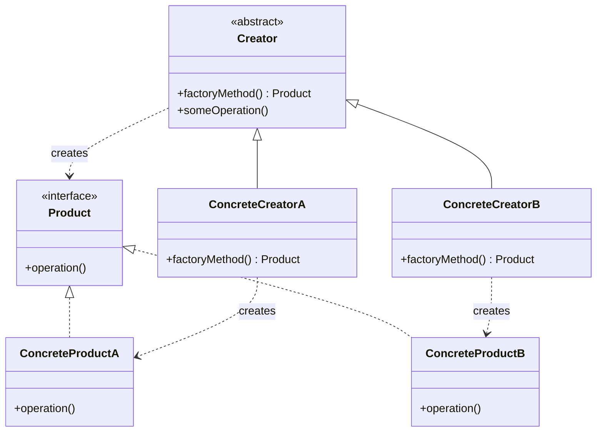
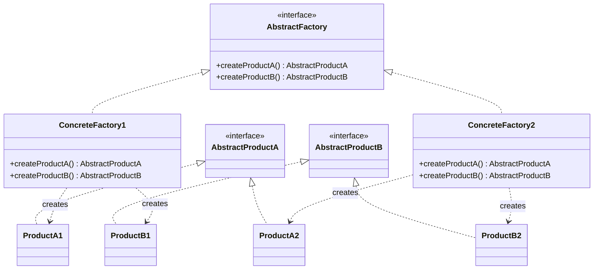
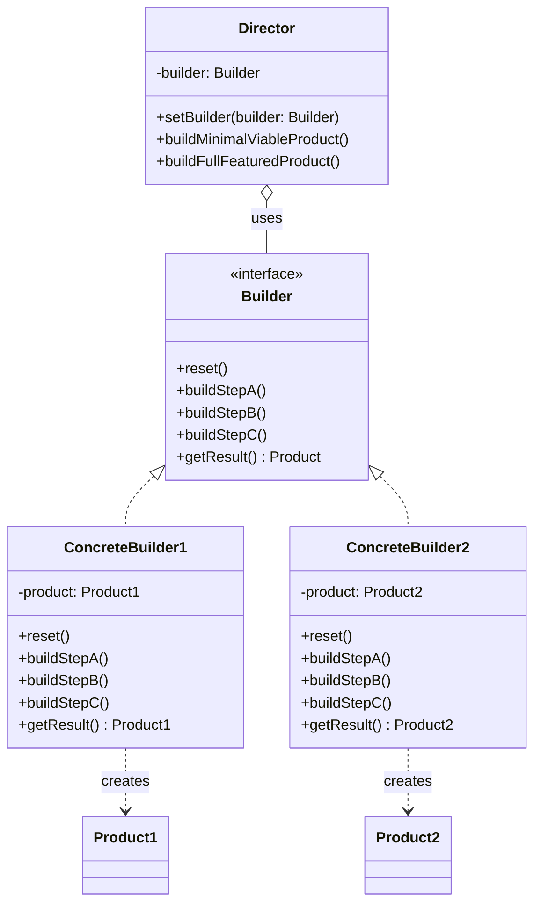
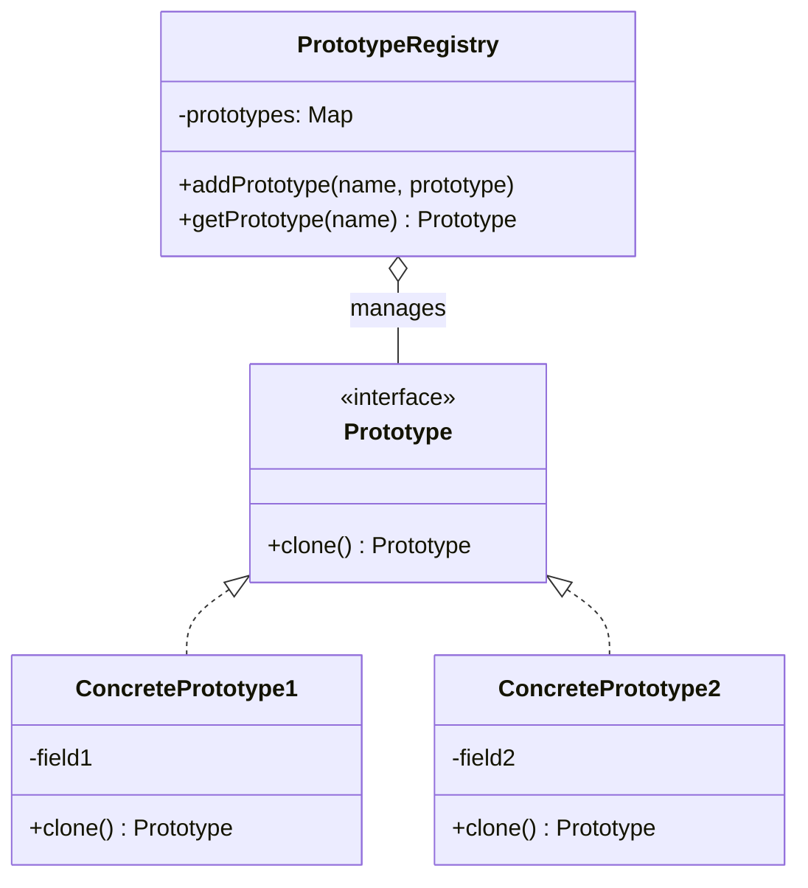
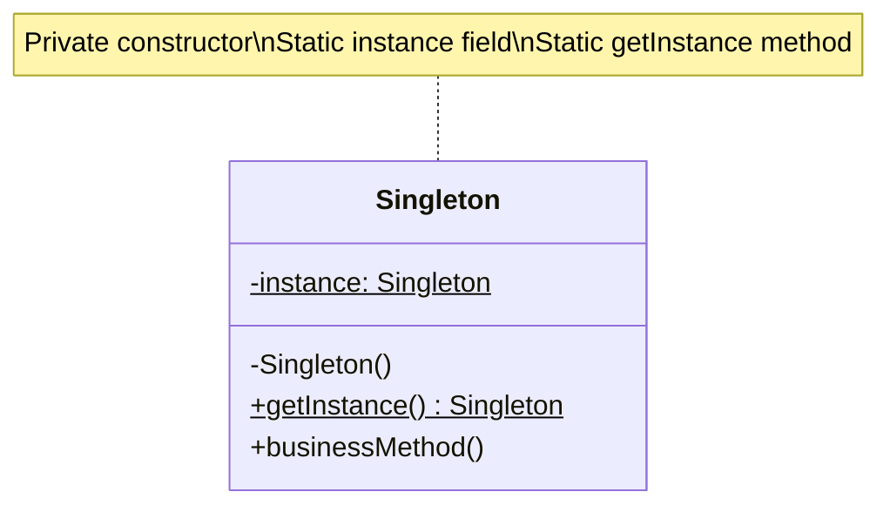

# Creational Design Patterns

Detailed reference for the 5 creational patterns that deal with object creation mechanisms.

---

## Factory Method

### Intent
Provides an interface for creating objects in a superclass, but allows subclasses to alter the type of objects that will be created.

### Problem
You can't anticipate the class of objects you need to create, or you want to let subclasses decide what class to instantiate.

### Solution
Replace direct object construction calls with calls to a special factory method. Subclasses override this method to change the class of products being created.

### Real-World Analogy
A logistics company that started with truck transport and now needs to add sea logistics. Instead of modifying all code, create separate factory methods for each transport type.

### Structure (Mermaid)



### Pseudocode

```pseudocode
// Product interface
interface Transport is
    method deliver()

// Concrete products
class Truck implements Transport is
    method deliver() is
        print "Delivering by land"

class Ship implements Transport is
    method deliver() is
        print "Delivering by sea"

// Creator with factory method
abstract class Logistics is
    abstract method createTransport(): Transport

    method planDelivery() is
        transport = createTransport()
        transport.deliver()

// Concrete creators
class RoadLogistics extends Logistics is
    method createTransport(): Transport is
        return new Truck()

class SeaLogistics extends Logistics is
    method createTransport(): Transport is
        return new Ship()
```

### Applicability
- When you don't know beforehand the exact types of objects your code should work with
- When you want to provide users with a way to extend internal components
- When you want to save system resources by reusing existing objects

### How to Implement
1. Make all products follow the same interface
2. Add an empty factory method inside the creator class
3. Find all references to product constructors and replace with factory method calls
4. Create creator subclasses for each product type, overriding the factory method
5. If product types are many, use a parameter in the base factory method

### Pros and Cons

**Pros:**
- Avoids tight coupling between creator and concrete products
- Single Responsibility Principle (product creation in one place)
- Open/Closed Principle (new products without breaking existing code)

**Cons:**
- Code may become more complicated with many new subclasses

### Relations with Other Patterns
- Many designs start with Factory Method and evolve toward Abstract Factory, Prototype, or Builder
- Abstract Factory often uses Factory Methods
- Factory Method is a specialization of Template Method

---

## Abstract Factory

### Intent
Produces families of related objects without specifying their concrete classes.

### Problem
You need to create families of related objects (e.g., UI components for different operating systems) but don't want to depend on concrete classes.

### Solution
Declare an interface for each distinct product in the product family. Create a factory interface with creation methods for all products. Implement concrete factories for each variant.

### Real-World Analogy
Furniture shop selling chairs, sofas, and tables in Modern, Victorian, and ArtDeco styles. Each factory produces matching furniture of one style.

### Structure (Mermaid)



### Pseudocode

```pseudocode
// Abstract factory interface
interface GUIFactory is
    method createButton(): Button
    method createCheckbox(): Checkbox

// Concrete factories
class WinFactory implements GUIFactory is
    method createButton(): Button is
        return new WinButton()
    method createCheckbox(): Checkbox is
        return new WinCheckbox()

class MacFactory implements GUIFactory is
    method createButton(): Button is
        return new MacButton()
    method createCheckbox(): Checkbox is
        return new MacCheckbox()

// Product interfaces
interface Button is
    method paint()

interface Checkbox is
    method paint()

// Concrete products
class WinButton implements Button is
    method paint() is
        print "Windows button"

class MacButton implements Button is
    method paint() is
        print "Mac button"
```

### Applicability
- When code needs to work with various families of related products
- When you have a class with Factory Methods that blur its primary responsibility

### How to Implement
1. Map out distinct product types and variants
2. Declare abstract product interfaces for all product types
3. Declare the abstract factory interface with creation methods
4. Implement concrete factory classes for each variant
5. Create factory initialization code that instantiates the right factory

### Pros and Cons

**Pros:**
- Products from same factory are guaranteed to be compatible
- Avoids tight coupling between concrete products and client code
- Single Responsibility Principle
- Open/Closed Principle

**Cons:**
- Code becomes more complicated with many new interfaces

### Relations with Other Patterns
- Often based on Factory Methods but can also use Prototype
- Builder focuses on step-by-step construction; Abstract Factory returns products immediately
- Can serve as alternative to Facade for hiding creation details

---

## Builder

### Intent
Constructs complex objects step by step, allowing different representations using the same construction code.

### Problem
A complex object requires laborious initialization of many fields and nested objects. You want to avoid telescoping constructors and allow flexible construction.

### Solution
Extract object construction code into separate builder objects. Organize construction into steps. Call only the steps needed for a particular configuration.

### Real-World Analogy
Building a house - you can start with foundation, then walls, then roof. A cabin uses wood, a castle uses stone, a palace uses gold. Same steps, different materials.

### Structure (Mermaid)



### Pseudocode

```pseudocode
// Builder interface
interface Builder is
    method reset()
    method setSeats(number)
    method setEngine(engine)
    method setTripComputer()
    method setGPS()

// Concrete builder
class CarBuilder implements Builder is
    private field car: Car

    method reset() is
        this.car = new Car()

    method setSeats(number) is
        car.seats = number

    method setEngine(engine) is
        car.engine = engine

    method setTripComputer() is
        car.tripComputer = true

    method setGPS() is
        car.gps = true

    method getResult(): Car is
        product = this.car
        this.reset()
        return product

// Director (optional)
class Director is
    method constructSportsCar(builder: Builder) is
        builder.reset()
        builder.setSeats(2)
        builder.setEngine(new SportEngine())
        builder.setTripComputer()
        builder.setGPS()
```

### Applicability
- To get rid of telescoping constructors
- When you want different representations of a product using same construction code
- To construct Composite trees or other complex objects

### How to Implement
1. Define common construction steps for all product representations
2. Declare steps in the base builder interface
3. Create concrete builder classes implementing all steps
4. Consider creating a director class for standard construction routines
5. Client code creates builder, passes to director, and retrieves result

### Pros and Cons

**Pros:**
- Construct objects step-by-step, defer or run steps recursively
- Reuse same construction code for different representations
- Single Responsibility Principle

**Cons:**
- Overall complexity increases with multiple new classes

### Relations with Other Patterns
- Many designs start with Factory Method and evolve toward Builder
- Builder focuses on step-by-step construction; Abstract Factory returns products immediately
- Can be used with Bridge (director as abstraction, builders as implementation)
- Often combined with Composite for building complex trees

---

## Prototype

### Intent
Clones existing objects without making code dependent on their classes.

### Problem
You need to copy an object, but can't access private fields or don't know the concrete class.

### Solution
Delegate cloning to the actual objects being cloned. Declare a common interface with a `clone` method. Objects clone themselves.

### Real-World Analogy
Cell division (mitosis) - a cell creates an identical copy of itself. The original cell acts as prototype.

### Structure (Mermaid)



### Pseudocode

```pseudocode
// Prototype interface
interface Prototype is
    method clone(): Prototype

// Base prototype with cloning constructor
abstract class Shape is
    field x: int
    field y: int
    field color: string

    constructor Shape(source: Shape) is
        this.x = source.x
        this.y = source.y
        this.color = source.color

    abstract method clone(): Shape

// Concrete prototype
class Rectangle extends Shape is
    field width: int
    field height: int

    constructor Rectangle(source: Rectangle) is
        super(source)
        this.width = source.width
        this.height = source.height

    method clone(): Shape is
        return new Rectangle(this)

// Client code
class Application is
    field shapes: array of Shape

    method businessLogic() is
        shapesCopy = new Array
        foreach (s in shapes) do
            shapesCopy.add(s.clone())
```

### Applicability
- When code shouldn't depend on concrete classes of objects to copy
- To reduce number of subclasses that only differ in initialization

### How to Implement
1. Create prototype interface with clone method
2. Define prototype constructor that accepts object of same class as argument
3. Clone method creates object using prototypical constructor
4. Optionally create prototype registry for frequently-used prototypes

### Pros and Cons

**Pros:**
- Clone objects without coupling to concrete classes
- Get rid of repeated initialization code
- Produce complex objects more conveniently
- Alternative to inheritance for configuration presets

**Cons:**
- Cloning complex objects with circular references is tricky

### Relations with Other Patterns
- Abstract Factory often uses Prototype for composing factory methods
- Prototype can help save copies of Commands into history
- Works well with Composite and Decorator for cloning complex structures
- Often simpler alternative to Memento for straightforward objects

---

## Singleton

### Intent
Ensures a class has only one instance while providing global access to it.

### Problem
You need strict control over global variables and want to ensure only one instance exists.

### Solution
Make the default constructor private, create a static creation method that returns the same instance (creating it on first call).

### Real-World Analogy
A government - a country can have only one official government. Regardless of individuals' identities, "The Government" is a global access point.

### Structure (Mermaid)



### Pseudocode

```pseudocode
class Database is
    private static field instance: Database

    private constructor Database() is
        // Initialization code

    public static method getInstance(): Database is
        if (Database.instance == null) then
            acquireThreadLock() and then
                if (Database.instance == null) then
                    Database.instance = new Database()
        return Database.instance

    public method query(sql) is
        // Business logic

// Client code
class Application is
    method main() is
        Database foo = Database.getInstance()
        foo.query("SELECT ...")

        Database bar = Database.getInstance()
        // bar contains same object as foo
```

### Applicability
- When a class should have just one instance (e.g., database connection)
- When you need stricter control over global variables

### How to Implement
1. Add private static field for storing singleton instance
2. Declare public static creation method
3. Implement lazy initialization in static method
4. Make constructor private
5. Replace direct constructor calls with static method calls

### Pros and Cons

**Pros:**
- Sure a class has only one instance
- Global access point to that instance
- Initialized only when first requested

**Cons:**
- Violates Single Responsibility Principle
- Can mask bad design when components know too much about each other
- Requires special treatment in multithreaded environment
- Difficult to unit test (private constructor, static methods)

### Relations with Other Patterns
- Facade often becomes Singleton since single facade object is sufficient
- Flyweight resembles Singleton but with multiple instances and immutable objects
- Abstract Factory, Builder, and Prototype can be implemented as Singletons
