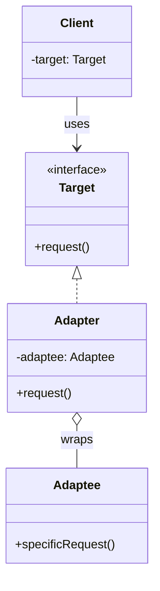
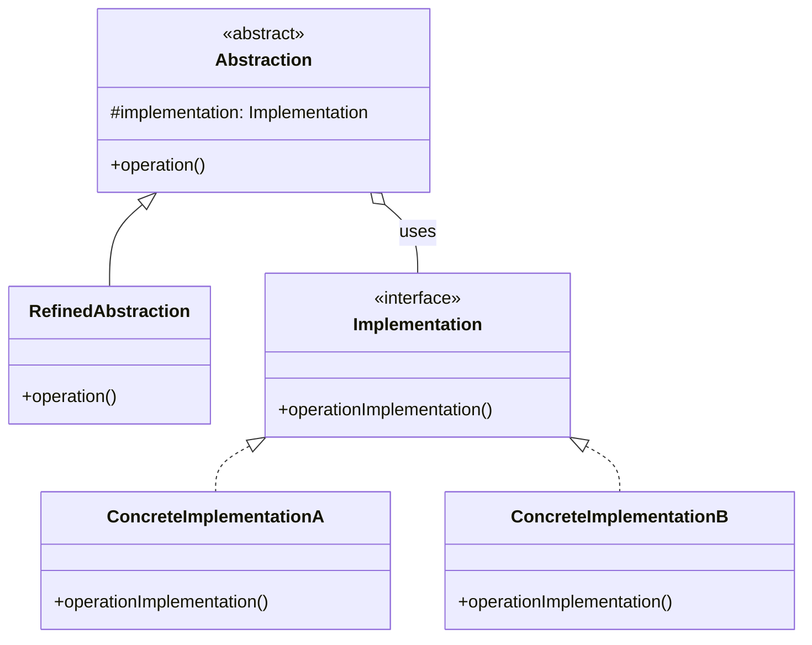
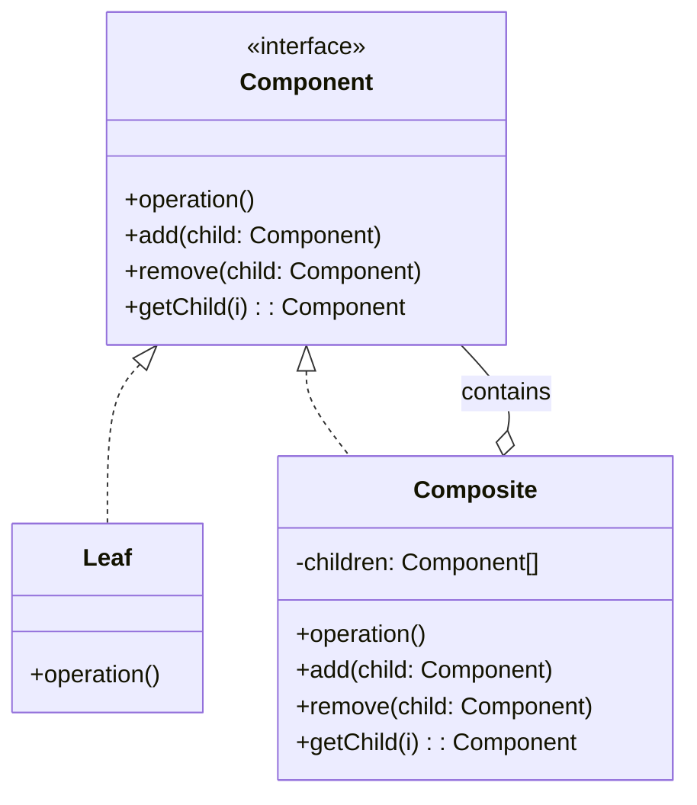
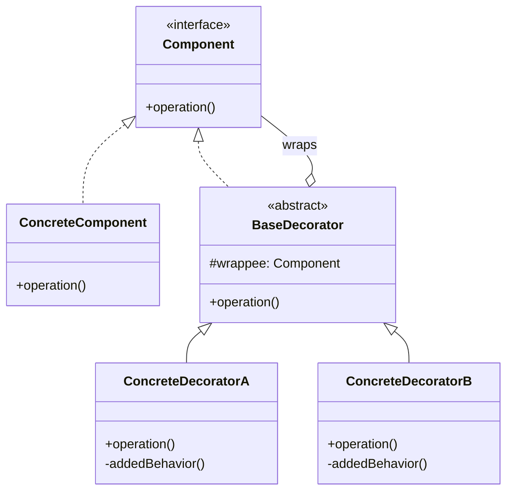
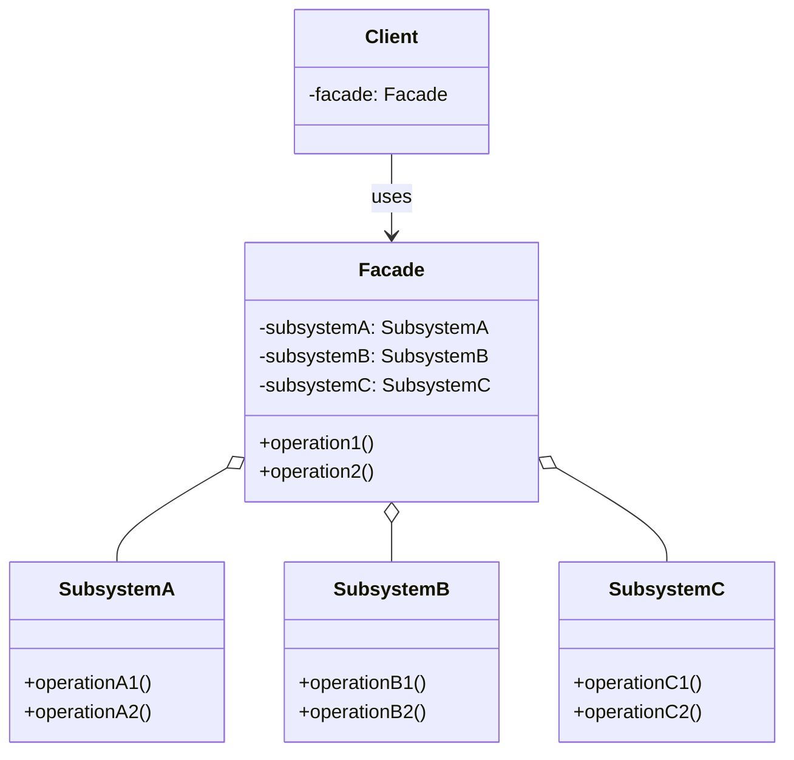
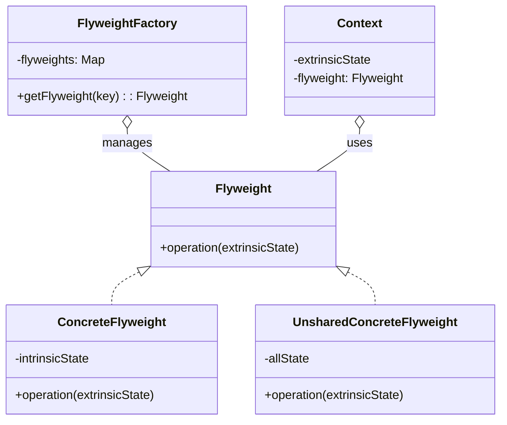
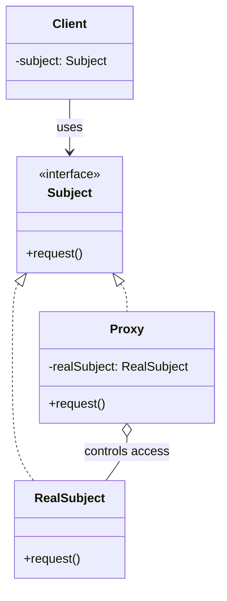

# Structural Design Patterns

Detailed reference for the 7 structural patterns that deal with composing classes and objects into larger structures.

---

## Adapter

### Intent
Allows objects with incompatible interfaces to collaborate.

### Problem
You want to use an existing class, but its interface doesn't match what you need.

### Solution
Create an adapter class that wraps the incompatible object and translates calls to a format the wrapped object understands.

### Real-World Analogy
A power plug adapter that lets a US plug fit into a European socket. The adapter translates between two incompatible interfaces.

### Structure (Mermaid)



### Pseudocode

```pseudocode
// Target interface expected by client
interface RoundPeg is
    method getRadius(): float

// Incompatible class
class SquarePeg is
    field width: float

    constructor SquarePeg(width) is
        this.width = width

    method getWidth(): float is
        return this.width

// Adapter makes SquarePeg work with RoundHole
class SquarePegAdapter extends RoundPeg is
    private field peg: SquarePeg

    constructor SquarePegAdapter(peg) is
        this.peg = peg

    method getRadius(): float is
        // Calculate radius of smallest circle that fits square
        return peg.getWidth() * sqrt(2) / 2

// Client
class RoundHole is
    field radius: float

    constructor RoundHole(radius) is
        this.radius = radius

    method fits(peg: RoundPeg): boolean is
        return this.radius >= peg.getRadius()
```

### Applicability
- When you want to use existing class with incompatible interface
- When you want to reuse subclasses lacking common functionality

### How to Implement
1. Identify client interface and incompatible service class
2. Create adapter class following client interface
3. Add field to adapter for storing reference to service object
4. Implement client interface methods, delegating to service object

### Pros and Cons

**Pros:**
- Single Responsibility Principle (interface conversion in one place)
- Open/Closed Principle (new adapters without changing existing code)

**Cons:**
- Overall complexity increases

### Relations with Other Patterns
- Bridge designed up-front; Adapter used with existing code
- Adapter changes interface; Decorator extends interface; Proxy keeps same interface
- Facade creates new interface for subsystem; Adapter makes existing interface usable

---

## Bridge

### Intent
Splits a large class or set of closely related classes into two separate hierarchies—abstraction and implementation—that can be developed independently.

### Problem
A class grows in multiple orthogonal dimensions (e.g., shape × color). Creating subclass for each combination causes exponential growth.

### Solution
Extract one dimension into separate class hierarchy. Original class references object from new hierarchy instead of having all state.

### Real-World Analogy
Remote control (abstraction) and TV (implementation). Same remote can control different TVs. You can change either independently.

### Structure (Mermaid)



### Pseudocode

```pseudocode
// Implementation interface
interface Device is
    method isEnabled(): boolean
    method enable()
    method disable()
    method getVolume(): int
    method setVolume(percent: int)

// Concrete implementations
class Tv implements Device is
    field enabled: boolean
    field volume: int
    // implement all Device methods

class Radio implements Device is
    field enabled: boolean
    field volume: int
    // implement all Device methods

// Abstraction
class RemoteControl is
    protected field device: Device

    constructor RemoteControl(device: Device) is
        this.device = device

    method togglePower() is
        if (device.isEnabled())
            device.disable()
        else
            device.enable()

    method volumeDown() is
        device.setVolume(device.getVolume() - 10)

// Refined abstraction
class AdvancedRemoteControl extends RemoteControl is
    method mute() is
        device.setVolume(0)
```

### Applicability
- When you want to divide monolithic class with several variants of functionality
- When you need to extend class in several orthogonal dimensions
- When you need to switch implementations at runtime

### How to Implement
1. Identify orthogonal dimensions in classes
2. Define operations client needs in base abstraction class
3. Declare implementation interface with operations for all platforms
4. Create concrete implementations for each platform
5. Add implementation reference field to abstraction class
6. Create refined abstractions for variants of high-level logic

### Pros and Cons

**Pros:**
- Platform-independent classes and apps
- Client code works with high-level abstractions
- Open/Closed Principle
- Single Responsibility Principle

**Cons:**
- May overcomplicate highly cohesive classes

### Relations with Other Patterns
- Bridge designed up-front; Adapter used with existing code
- Bridge, State, Strategy have similar structures but solve different problems
- Abstract Factory can work with Bridge to encapsulate relations

---

## Composite

### Intent
Composes objects into tree structures and lets clients work uniformly with individual objects and compositions.

### Problem
You need to work with a tree-like object structure (e.g., files and folders) uniformly, treating individual and composite objects the same way.

### Solution
Make all elements follow a common interface. Composites can contain other elements.

### Real-World Analogy
Military hierarchy—army → divisions → brigades → platoons → squads → soldiers. Orders pass down the tree uniformly.

### Structure (Mermaid)



### Pseudocode

```pseudocode
// Component interface
interface Graphic is
    method move(x, y)
    method draw()

// Leaf
class Dot implements Graphic is
    field x, y: int

    method move(x, y) is
        this.x += x
        this.y += y

    method draw() is
        // draw dot at x,y

// Composite
class CompoundGraphic implements Graphic is
    field children: array of Graphic

    method add(child: Graphic) is
        children.add(child)

    method remove(child: Graphic) is
        children.remove(child)

    method move(x, y) is
        foreach (child in children) do
            child.move(x, y)

    method draw() is
        foreach (child in children) do
            child.draw()
```

### Applicability
- When you have to implement tree-like object structure
- When you want client code to treat simple and complex elements uniformly

### How to Implement
1. Ensure core model can be represented as tree
2. Declare component interface with methods for both simple and complex components
3. Create leaf class for simple elements
4. Create container class with array field for storing children
5. Client works with components via interface

### Pros and Cons

**Pros:**
- Work with complex tree structures more conveniently
- Open/Closed Principle

**Cons:**
- Hard to provide common interface for classes with very different functionality

### Relations with Other Patterns
- Builder can construct complex Composite trees recursively
- Chain of Responsibility often used with Composite
- Iterators can traverse Composite trees
- Visitor can execute operations over entire Composite tree
- Composite and Decorator have similar structure; Decorator has one child, Composite has many

---

## Decorator

### Intent
Attaches new behaviors to objects by placing them in wrapper objects that contain the behaviors.

### Problem
You need to add behaviors to objects at runtime without creating many subclasses.

### Solution
Create wrapper objects ("decorators") that implement the same interface and delegate work to wrapped object while adding behavior before/after.

### Real-World Analogy
Wearing clothes—sweater, jacket, raincoat. Each garment "extends" your base behavior but isn't part of you.

### Structure (Mermaid)



### Pseudocode

```pseudocode
// Component interface
interface DataSource is
    method writeData(data)
    method readData(): string

// Concrete component
class FileDataSource implements DataSource is
    method writeData(data) is
        // write to file
    method readData(): string is
        // read from file

// Base decorator
class DataSourceDecorator implements DataSource is
    protected field wrappee: DataSource

    constructor DataSourceDecorator(source: DataSource) is
        this.wrappee = source

    method writeData(data) is
        wrappee.writeData(data)

    method readData(): string is
        return wrappee.readData()

// Concrete decorators
class EncryptionDecorator extends DataSourceDecorator is
    method writeData(data) is
        encryptedData = encrypt(data)
        wrappee.writeData(encryptedData)

    method readData(): string is
        data = wrappee.readData()
        return decrypt(data)

class CompressionDecorator extends DataSourceDecorator is
    method writeData(data) is
        compressedData = compress(data)
        wrappee.writeData(compressedData)

    method readData(): string is
        data = wrappee.readData()
        return decompress(data)
```

### Applicability
- When you need to assign extra behaviors at runtime without breaking code
- When inheritance is awkward or impossible (final classes)

### How to Implement
1. Ensure business domain can be represented as primary component with optional layers
2. Create component interface with common methods
3. Create concrete component class with base behavior
4. Create base decorator class with field for wrapped object
5. Create concrete decorators extending base decorator
6. Client creates decorators and composes them

### Pros and Cons

**Pros:**
- Extend object behavior without new subclass
- Add/remove responsibilities at runtime
- Combine several behaviors by wrapping multiple times
- Single Responsibility Principle

**Cons:**
- Hard to remove specific wrapper from stack
- Hard to implement decorator independent of order
- Initial configuration looks ugly

### Relations with Other Patterns
- Adapter changes interface; Decorator extends interface; Proxy keeps same interface
- Chain of Responsibility and Decorator have similar structure but different intents
- Composite and Decorator rely on recursive composition
- Decorator changes object's skin; Strategy changes its guts

---

## Facade

### Intent
Provides a simplified interface to a library, framework, or complex set of classes.

### Problem
You need to work with a complex subsystem containing many objects with their own interfaces, making the code hard to maintain.

### Solution
Create a facade class providing simple interface to complex subsystem. Facade delegates work to subsystem objects.

### Real-World Analogy
Phone ordering at a shop—the operator is a facade to ordering, payment, and delivery services.

### Structure (Mermaid)



### Pseudocode

```pseudocode
// Complex subsystem classes
class VideoFile is
    // ...

class OggCompressionCodec is
    // ...

class MPEG4CompressionCodec is
    // ...

class CodecFactory is
    method extract(file): Codec

class BitrateReader is
    method read(file, codec): Buffer
    method convert(buffer, codec): Buffer

class AudioMixer is
    method fix(buffer): Buffer

// Facade
class VideoConverter is
    method convert(filename, format): File is
        file = new VideoFile(filename)
        sourceCodec = new CodecFactory().extract(file)

        if (format == "mp4")
            destinationCodec = new MPEG4CompressionCodec()
        else
            destinationCodec = new OggCompressionCodec()

        buffer = BitrateReader.read(file, sourceCodec)
        result = BitrateReader.convert(buffer, destinationCodec)
        result = new AudioMixer().fix(result)

        return new File(result)
```

### Applicability
- When you need limited but straightforward interface to complex subsystem
- When you want to structure a subsystem into layers

### How to Implement
1. Check if simpler interface than subsystem already exists
2. Declare and implement facade class redirecting calls to appropriate subsystem objects
3. Make all client code work with subsystem via facade
4. If facade becomes too big, extract part to new facade

### Pros and Cons

**Pros:**
- Isolate code from complexity of subsystem

**Cons:**
- Facade can become god object coupled to all classes

### Relations with Other Patterns
- Facade defines new interface; Adapter makes existing interface usable
- Abstract Factory can be alternative to Facade for hiding object creation
- Flyweight shows how to make many small objects; Facade shows single object for subsystem
- Facade and Mediator try to organize collaboration between classes differently
- Facade can often be a Singleton

---

## Flyweight

### Intent
Fits more objects into RAM by sharing common parts of state between multiple objects.

### Problem
Running out of RAM due to massive number of similar objects.

### Solution
Extract shared (intrinsic) state into separate flyweight objects. Keep unique (extrinsic) state in context objects.

### Real-World Analogy
Tea shop with shared tea flavor objects and individual table orders. Each order doesn't need its own tea instance.

### Structure (Mermaid)



### Pseudocode

```pseudocode
// Flyweight with intrinsic state
class TreeType is
    field name: string
    field color: string
    field texture: string

    constructor TreeType(name, color, texture)

    method draw(canvas, x, y) is
        // Draw tree of this type at position

// Flyweight factory
class TreeFactory is
    static field treeTypes: Map

    static method getTreeType(name, color, texture): TreeType is
        key = name + color + texture
        if (!treeTypes.has(key))
            treeTypes[key] = new TreeType(name, color, texture)
        return treeTypes[key]

// Context with extrinsic state
class Tree is
    field x, y: int
    field type: TreeType

    constructor Tree(x, y, type)

    method draw(canvas) is
        type.draw(canvas, x, y)

// Client
class Forest is
    field trees: array of Tree

    method plantTree(x, y, name, color, texture) is
        type = TreeFactory.getTreeType(name, color, texture)
        trees.add(new Tree(x, y, type))
```

### Applicability
- Only when program must support huge number of objects that barely fit into RAM

### How to Implement
1. Divide class fields into intrinsic (shared) and extrinsic (unique) state
2. Leave intrinsic fields in class, make them immutable
3. Add extrinsic state parameters to methods that need them
4. Optionally create factory to manage flyweight pool
5. Client stores or calculates extrinsic state

### Pros and Cons

**Pros:**
- Save lots of RAM with many similar objects

**Cons:**
- Trade RAM for CPU cycles (recalculating context)
- Code becomes more complicated

### Relations with Other Patterns
- Composite shared leaf nodes can be Flyweights
- Flyweight makes many small objects; Facade makes one object for subsystem
- Flyweight resembles Singleton but with multiple instances and immutable objects

---

## Proxy

### Intent
Provides a substitute or placeholder for another object to control access to it.

### Problem
You need to control access to an object, add behavior, or delay expensive initialization.

### Solution
Create new proxy class with same interface as service object. Proxy handles requests before passing to real object.

### Real-World Analogy
Credit card is proxy for bank account (which is proxy for cash). Same interface (payment), different implementation.

### Structure (Mermaid)



### Pseudocode

```pseudocode
// Service interface
interface ThirdPartyYouTubeLib is
    method listVideos()
    method getVideoInfo(id)
    method downloadVideo(id)

// Real service
class ThirdPartyYouTubeClass implements ThirdPartyYouTubeLib is
    method listVideos() is
        // Send API request to YouTube
    method getVideoInfo(id) is
        // Get metadata
    method downloadVideo(id) is
        // Download video

// Caching proxy
class CachedYouTubeClass implements ThirdPartyYouTubeLib is
    private field service: ThirdPartyYouTubeLib
    private field listCache, videoCache

    constructor CachedYouTubeClass(service) is
        this.service = service

    method listVideos() is
        if (listCache == null)
            listCache = service.listVideos()
        return listCache

    method getVideoInfo(id) is
        if (videoCache[id] == null)
            videoCache[id] = service.getVideoInfo(id)
        return videoCache[id]

    method downloadVideo(id) is
        if (!downloadExists(id))
            service.downloadVideo(id)
```

### Applicability

**Types of proxies:**
- **Virtual proxy**: Lazy initialization for heavy objects
- **Protection proxy**: Access control
- **Remote proxy**: Local representation of remote service
- **Logging proxy**: Request logging
- **Caching proxy**: Cache results
- **Smart reference**: Track usage and dismiss when unused

### How to Implement
1. Create service interface if none exists
2. Create proxy class with reference to service
3. Implement proxy methods according to purpose
4. Consider factory method for deciding proxy vs real service
5. Consider lazy initialization for service

### Pros and Cons

**Pros:**
- Control service object without clients knowing
- Manage lifecycle when clients don't care
- Works even if service not ready
- Open/Closed Principle

**Cons:**
- Code more complicated
- Response might get delayed

### Relations with Other Patterns
- Adapter gives different interface; Proxy keeps same interface; Decorator gives enhanced interface
- Facade and Proxy buffer complex entity; Proxy has same interface, making them interchangeable
- Decorator and Proxy have similar structures but different intents
